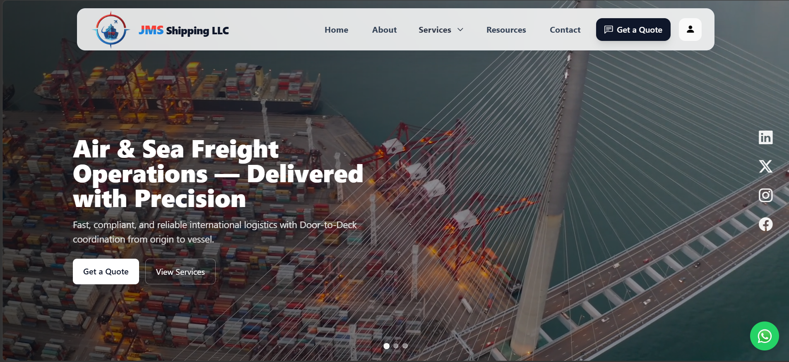
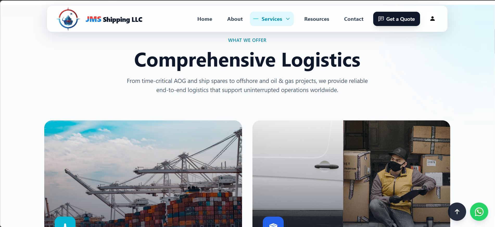
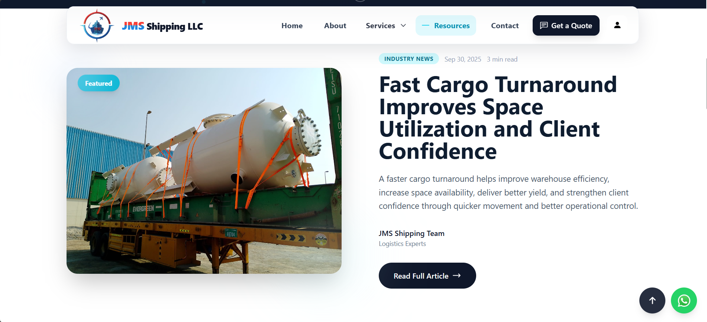
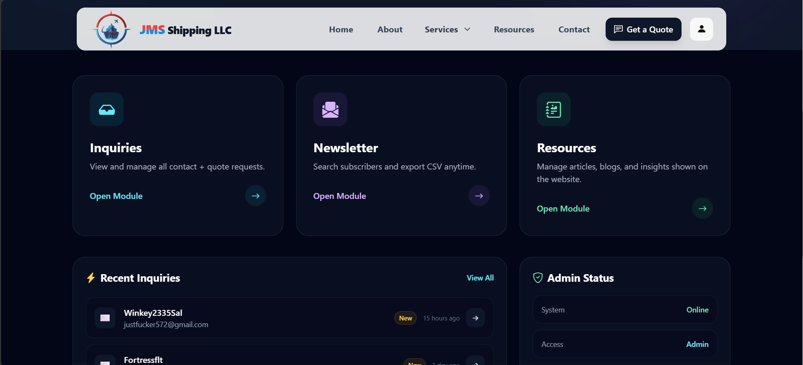

# JMSS Shipping

🌐 Live Website: https://jmsshipping.com

## Overview

JMSS Shipping is a modern, international logistics and shipping platform designed with a clean and high-performance user experience. The website follows global UI/UX standards and provides dynamic content management through a powerful admin panel.

The platform is built to deliver smooth interactions, visually engaging layouts, and scalable backend control for real-world business operations.

---

## Key Features

### 🌍 Frontend (User Experience)

* Modern, clean UI based on international design standards
* Smooth scrolling experience
* Parallax effects for enhanced visual depth
* Dynamic sliders and interactive sections
* Fully responsive across all devices
* Optimized performance and fast loading

---

### ⚙️ Admin Panel (Backend Control)

* Dynamic **resource/service management**
* Blog management system
* User reviews management
* Newsletter subscription handling
* Quote request management system
* Full content control without code changes

---

## Tech Stack

* **Backend:** Laravel
* **Frontend:** Tailwind CSS, Alpine.js, JavaScript, jQuery
* **Database:** MySQL

---

## Screenshots

### Homepage

### Services / Resources

### Blog Section

### Admin Panel

---

## Installation

1. Clone the repository
2. Run `composer install`
3. Configure `.env` file
4. Run `php artisan migrate`
5. Start server with `php artisan serve`

---

## Live Demo

https://jmsshipping.com

---

## Author

Anas Ahamed
